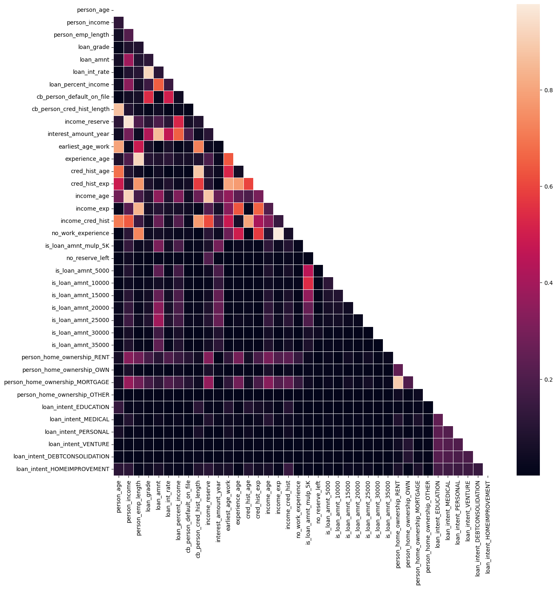
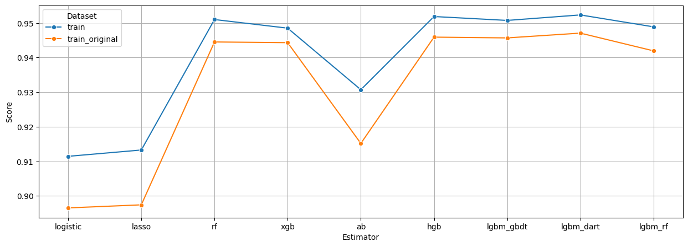

## Loan Approval

This notebook is created for the Kaggle Playground Series S4E10 Competition.

### Overview

The goal for this competition is to try to predict whether a loan application will be approved or not. The dataset here is synthetically generated for the competition from a previous dataset. The original dataset is also provided for us in the competition.

### Features

-   Uses separate scikit pipelines with separate data transformations for different models in order to achieve model diversity.
-   Incorporates the Feature-engine library in order to enable complex data transformations within pipelines such as Quantile Discretization, Categorical Imputation, etc.
-   Data visualization plots are created using seaborn in order to enable Exploratory Data Analysis.
-   RandomizedSearchCV is used in order to evaluate the many good sets of hyperparameters against the pipelines.

### Correlation Heatmap

Here is the correlation matrix heatmap after the data transformations.

### Models + Results

For this competition, I used many flavours of different learning algorithms including logistic, random forest, xgboost, and different flavours of lightGBM, etc. I tried separate boosting types for LightGBM models including dart, gbdt, and rf. Additionally, I also evaluated all of the models again by including the original dataset with the training set. Here are the results in 10 fold cross validation scores.

### Cross validation

For scores, I used a variant of KFold called StratifiedKFold due to the imbalance of the dataset (80% - 20%) against the target feature. KFold here was used since I had many models to evaluate scores and so a basic validation set didn't suffice. For K, I used a value of 10 since the dataset was big enough to consider using higher amount of folds.

### Future Ideas

-   Use stacking ensemble for the different variants of models.
-   Try hillclimbing models as a separate ensemble strategy.
-   Explore the usage of Explainable AI libraries to get a deeper understanding of the dataset.

### Acknowledgements

-   [Kaggle Competition Link](https://duckduckgo.com) for the official competition.
-   [Kaggle Notebook Authors](https://www.kaggle.com/competitions/playground-series-s4e10/code?competitionId=84894&sortBy=voteCount&excludeNonAccessedDatasources=true) for their generosity in sharing clever insights and approaches.
-   [Feature engine](https://feature-engine.trainindata.com/en/latest/index.html) to simplify data transformation operations within scikit Pipelines.
-   [Seaborn](https://seaborn.pydata.org) for data visualization tasks
